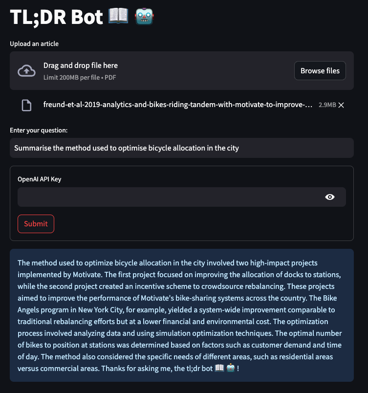

# TL;DR Bot 📖 🤖 - Chat with your documents
A chatbot powered by LangCHain that augments GPT 3.5 with the contents of your own documents.

## Future Updates

- Allow uploading of multiple documents

## New Fixes
- Allow reading of word documents (docx) (Updated 9 Dec 2023)
- Created Jemmet version 2! (chatbot with chat history). Visit Jememt v2 here: https://llm-for-good-jemmet-v2.streamlit.app/

## Overview of the App

- Takes user queries via Streamlit's `st.chat_input` and displays both user queries and model responses with `st.chat_message`
- Uses RAG LangChain to load and index data and create a chat engine that will retrieve context from that data to respond to each user query

## Demo App

## Get an OpenAI API key

You can get your own OpenAI API key by following the following instructions:
1. Go to https://platform.openai.com/account/api-keys.
2. Click on the `+ Create new secret key` button.
3. Next, enter an identifier name (optional) and click on the `Create secret key` button.

## Try out the app

Once the app is loaded, enter your question about your document, enter your OpenAI API key and wait for a response.
